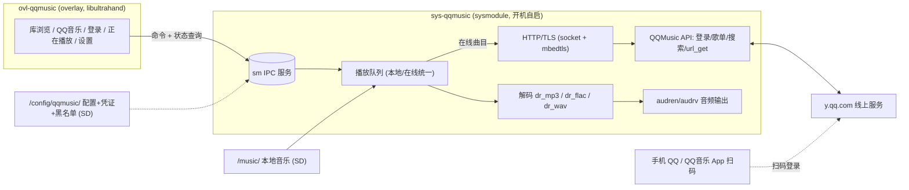

# NS-QQMusic 开发策划

> 目标：Nintendo Switch + 大气层（Atmosphère）平台的一个音乐"overlay 插件"——
> 游戏运行中呼出 UI，可播放 **SD 卡本地音乐**，登录 **QQ 音乐** 后播放线上音乐；
> 关闭 UI 后音乐在后台继续播放。

## 1. 架构决策

| | A. sysmodule + OVL overlay（推荐） | B. NSX 插件 |
|---|---|---|
| 形态 | 开机自启后台服务 `exefs.nsp` + `switch/.overlays/*.ovl` UI，经 **Ultrahand**（nx-ovlloader fork 加载）呼出 | 插件编译进目标游戏的 NSP，跑在游戏进程内，UI/输入挂接游戏 |
| 工具链 | devkitA64 + libnx + switch-tools（开源免费，无需官方 SDK） | 官方 NS SDK（需开发账号）+ NSX SDK（仓库地址 M0 待查证 [待核实]） |
| 安装 | 一次安装，全部游戏可用 | 每款游戏 NSP 单独打包 |
| 先例 | Nada（本地）、Streamfin（Jellyfin 在线流式）、sys-tune，均为 2026 活跃项目 | 游戏内 NSX 修改类居多；在线流式+登录组合无成熟先例 |
| 主要风险 | AudioRenderer 2 会话上限（部分游戏占满→静音）；依赖 Ultrahand 生态 | 与单游戏耦合；音频/资源与游戏进程竞争，兼容性风险高 |

**结论：默认走 A 路线。** 只有当需求是"嵌入某款特定游戏 NSP 内部"时才选 B。
A 路线前提：机器已装 nx-ovlloader（ppkantorski fork）+ Ultrahand Overlay。



核心原则（沿用 Nada/Streamfin）：**播放状态全部在 sysmodule；overlay 只是命令客户端**——
关 overlay 不断歌、切游戏不断歌、sysmodule 内存与解码压力小。

## 2. 技术选型

| 项 | 选择 | 依据 |
|---|---|---|
| 语言/编译 | C++（gnu++2x，`-fno-rtti -fno-exceptions`）、devkitA64 + libnx + switch-tools | Streamfin Makefile 实测配置 |
| 打包 | NRO→NSO→`exefs.nsp`（NPDM json 驱动）+ `.ovl`；`make dist` 产出 SD 布局 | Streamfin 根 Makefile |
| sysmodule 注册 | `atmosphere/contents/4200000000xxxxxx/`：`exefs.nsp` + `toolbox.json` + `flags/boot2.flag`（开机自启） | 自定义 TitleId（0x42 段），避开 Nada `…00ADA` / Streamfin `…494E` |
| UI 框架 | libultrahand（libtesla/libultra 扩展） | Streamfin `gui/`（键盘、列表、状态栏可直接借鉴） |
| 音频解码 | dr_libs：`dr_mp3`、`dr_flac`、`dr_wav`（OGG 二期加 `dr_vorbis`） | Nada / Streamfin 同款 |
| 音频输出 | `audren`/`audrv`（AudioRenderer）自建会话 + 重采样（48k stereo） | Nada `player.cpp`；睡眠后继续播放 |
| HTTP/TLS | POSIX socket（libnxExt 提供）+ mbedtls；熵源 `randomGet()`；首版 `VERIFY_NONE` + SNI | Streamfin `jelly_http.cpp`（含 DNS 不稳、连接打断等坑的成熟处理） |
| JSON | jsmn | Streamfin 同款 |
| 二维码 | qrcodegen（zserge，单文件 C） | 登录码屏显、手机扫码，无需手柄摄像头 |
| 元数据/封面 | ID3v2 / Vorbis Comments / APE；封面 stb_image + libjpeg-turbo，懒加载 | Nada `metadata/`（内嵌图→cover.jpg→cover.png→逐曲 jpg 兜底链） |
| QQ 音乐 API | web 接口，参照 L-1124/QQMusicApi（活跃维护的 Python 参考实现） | 见下 |
| 配置 | minIni，SD `/config/qqmusic/` | Streamfin / Nada |

### QQ 音乐 API 要点（来自 L-1124/QQMusicApi 参考实现）

- 主入口：`musicu.fcg` CGI（`module/method` 参数化）。
- **登录**：`music.login.LoginServer/Login`。方式：
  1. 扫码（QR，推荐）：QQ 授权 / 微信 / QQ 音乐 App（后两者含 MQTT 通道，首版只做 QQ 扫码）；
  2. 手机号 + 短信验证码（备选，需 overlay 键盘）。
- **凭证**：`musicid + musickey + uin`（+ refresh 字段/过期时间）。
  - 有效性：`music.UserInfo.userInfoServer/GetLoginUserInfo`；
  - 过期刷新：`Login` `loginMode=2`；刷新失败 → 重新登录。
- **错误码**：`1000/104401/104400` 凭证过期；`20277/20278` 账号受限；`20279` 设备超限；`104604` 频率限制（轮询节流）。
- **歌曲 URL**：`url_get` → `sip[].url`（C400/C800 MP3；无损/HiFi 需对应 VIP）；支持 HTTP Range 断点/seek。
- **曲库**：搜索、歌单、排行榜模块（M3 对照参考实现逐一对齐 module/method 与参数）。

## 3. 开发路径（里程碑）

### M0 环境与骨架（1–2 天）
- WSL2 (Ubuntu) + devkitPro（devkitA64/libnx/switch-tools）。
- 基于 sysmodule+overlay 模板搭骨架：sysmodule 启动（boot2.flag）+ ovl 被 Ultrahand 呼出 + IPC 命令 ping-pong + SD 调试日志。
- 真机：Atmosphère + nx-ovlloader（ppkantorski fork）+ Ultrahand；固件基线建议 **22.1.0 / Atmosphère 1.11.1**（Nada 验证过的组合）。
- 顺带查证：NSX SDK 仓库与模板（若切 B 路线用）。
- **验收**：`make dist` → zip 解压到 SD → 重启 → 快捷键呼出测试 overlay，sysmodule 正确应答命令并写日志。

### M1 本地播放引擎（sysmodule 内，无 UI，3–5 天）
- SD 扫描：`/music`（可配置）→ 专辑文件夹 → 曲目队列（文件名排序）。
- 解码管线：`dr_*` 解码 → 重采样 → 48k stereo 环形缓冲 → `audren/audrv`；防 underrun/卡死。
- 播放内核：play/pause/seek/next/prev/volume/shuffle/repeat；队列模型（本地/在线统一 track 结构：source + uri + 元数据）。
- IPC 命令接口 v1（命令枚举 + 参数 + 状态查询）。
- **验收**：本地 MP3/FLAC/WAV 无爆音播放；关 overlay、睡眠、切歌均稳定；IPC 全程可控。

### M2 本地 UI（overlay，3–5 天）
- 页面：库浏览（专辑→曲目）、正在播放（封面/标题滚动/seek 条/transport）、设置。
- 元数据懒加载 + 封面兜底链（Nada 同款）。
- 游戏黑名单：按 TitleId 自动暂停/恢复（SD ini，≤32 条）。
- AudioRenderer 会话被占满 → "音频不可用"状态显式提示（Nada 同款）。
- **验收**：本地音乐完整体验；长时间运行无内存泄漏（overlay 会话反复开关 ≥50 次）。

### M3 QQ 音乐线上（5–8 天）
- HTTP 客户端层（sysmodule 侧）：DNS（sysmodule 内解析 + IP 缓存）→ 连接 → TLS → 请求/流式；连接池；流式读取带超时与打断。
- 登录流程：
  1. **扫码（主）**：`get_qrcode` → qrcodegen 屏显 → 1.5s 轮询 check（已扫码后加快）→ 拿凭证；QR 过期自动换新；
  2. **手机+短信（备）**：overlay 键盘输入。
  3. 凭证持久化 `/config/qqmusic/credential`（musicid/musickey/uin/refresh/过期戳）；启动与使用时校验，过期自动刷新，刷新失败引导重登。
- 曲库：搜索 / 我的歌单 / 排行榜（jsmn 解析，分页）。
- 在线播放：`url_get` → 流式进环形缓冲；Range seek；非 VIP 遇 VIP 曲自动降级 128k（C400）并 UI 标记。
- **验收**：扫码登录 → 搜索 → 播放 → seek → 下一曲；关 overlay 不断歌、睡眠恢复；断网/凭证过期有明确错误态。

### M4 收尾与发布（3–5 天）
- 设置：音乐目录、默认音质、在线缓存开关（二期：最近播放缓存到 `/music_cache` 供离线）、黑名单管理。
- 内存预算与优雅降级（OOM → 提示而非崩溃）。
- README（安装/使用/排障，含 Streamfin 式"overlay 太多导致起播失败"提示）、release dist zip、GitHub Actions CI（devkitA64 docker）。
- **验收**：干净 SD 全流程走通；README 可复现。

**总估算：约 3–5 周（单人）。**

## 4. 风险与对策

1. **AudioRenderer 2 会话上限**：部分游戏占满两路会话 → 音乐无声（系统硬限制）。对策：TitleId 黑名单自动暂停/恢复 + 显式提示（Nada 既有方案）。
2. **homebrew 共享内存池小**：Streamfin 已警告"overlay/sysmodule 太多时起播失败"。对策：M1 起做内存预算（音频环 1–2 MB、TLS ~200 KB/连接、JSON 缓冲上限），全部缓冲设硬上限。
3. **QQ 音乐接口波动**：非官方 web API，可能限流（104604）、改参数。对策：参数与 L-1124/QQMusicApi 参考实现保持一致并定期比对；轮询节流；登录双通道（扫码+短信）。
4. **VIP 权限边界**：无损/HiFi 依赖会员等级；`url` 为空/403 → 降级 C400/C100 并标记。
5. **固件/大气层版本漂移**：锁基线 22.1.0/1.11.1；升固件后重验音频 ABI（任天堂跨大版本改过 ABI 的历史先例）。
6. **DNS 在 overlay 进程内不稳**：统一在 sysmodule 解析并缓存 IP（Streamfin 代码注释明确此坑）。
7. **证书校验**：首版 `VERIFY_NONE` + SNI（同 Streamfin），二期内置 `y.qq.com`/`c.y.qq.com` CA 链做真校验。
8. **TitleId 冲突**：自选 0x42 段号段，避开已知项目。
9. **登录 UX**：二维码显示在电视、手机扫码（无需 NS 摄像头）；短信登录依赖触屏键盘（libultrahand 有现成组件）。

## 5. 目录结构（草案）

```
ns-qqmusic/
├── Makefile                  # all/dist：overlay + sysmodule → SD 布局 zip
├── PLAN.md
├── common/                   # 两端共享
│   ├── ipc/                  # 命令协议 + ipc_server（nxExt）
│   ├── net/                  # socket + mbedtls HTTP/TLS 客户端
│   ├── audio/                # dr_* 解码 + 重采样 + audren 输出
│   ├── qqmusic/              # API：登录 / 刷新 / 歌单 / 搜索 / url_get
│   ├── meta/                 # ID3v2 / Vorbis / APE + 封面
│   └── config/               # minIni 配置/凭证/黑名单
├── sysmodule/                # sys-qqmusic（qqmusic.json + toolbox.json + boot2.flag）
├── overlay/                  # ovl-qqmusic（libultrahand UI）
└── third_party/              # dr_libs, jsmn, qrcodegen, stb_image, libultrahand
```

## 6. 先例与参考

- **Nada**（[ErrLogic/nada](https://github.com/ErrLogic/nada)）：本地 FLAC/MP3 后台播放 + overlay，sysmodule+ovl 架构蓝本（黑名单、封面链、AudioRenderer 兜底）。
- **Streamfin**（[dammitjeff/streamfin-switch](https://github.com/dammitjeff/streamfin-switch)）：Jellyfin 在线流式播放；HTTP/TLS（`jelly_http.cpp`）、JSON、解码器、overlay GUI 的直接实现参考。
- **sys-tune**（[HookedBehemoth/sys-tune](https://github.com/HookedBehemoth/sys-tune)）：Streamfin 的音频输出层基础。
- **Ultrahand**（[ppkantorski/Ultrahand-Overlay](https://github.com/ppkantorski/Ultrahand-Overlay)）+ **libultrahand**（[ppkantorski/libultrahand](https://github.com/ppkantorski/libultrahand)）+ **nx-ovlloader** fork：overlay 运行时与 UI 库。
- **L-1124/QQMusicApi**（[github.com/L-1124/QQMusicApi](https://github.com/L-1124/QQMusicApi)）：QQ 音乐 web API 参考实现（登录/刷新/凭证/错误码/歌单/下载）。
- **nx-sysmodule**（HookedBehemoth）：sysmodule 模板（nxExt：IPC server 等）。

## 7. 待确认问题

1. "overlap 插件" 是否即 Ultrahand overlay 插件路线（A）？若要嵌入特定游戏 NSP 则选 B（NSX）。
2. 机器是否已装 Ultrahand + nx-ovlloader（ppkantorski fork）？
3. 固件/Atmosphère 版本（建议跟 22.1.0/1.11.1 基线）。
4. 本地格式范围：MP3/FLAC/WAV 先行、OGG 二期，是否认可？
5. 是否接受"非 VIP 时 VIP 曲降级 128k"的默认策略？